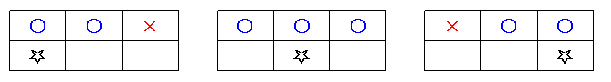

## 링크
[2096번: 내려가기](https://www.acmicpc.net/problem/2096)

## 풀이
<span class="txt_bg">`maxDp[i]`: `i`번째 칸까지의 최대 누적 합</span>\
<span class="txt_bg">`minDp[i]`: `i`번째 칸까지의 최소 누적 합</span>

{: .w="240" }

주어진 그림을 뒤집어 생각하면, 현재 칸에 도달할 수 있는 위치를 알 수 있습니다.\
윗줄에서 도달 가능한 위치들 중, 최댓값과 최솟값을 각각 더해 현재 칸의 누적 합을 계산합니다.

메모리 초과를 방지하기 위해 <span class="txt_bg">공간 최적화 방식</span>을 사용합니다.\
전체 테이블을 저장하지 않고, 이전 줄의 최대/최소 누적 합만 유지하며 갱신합니다.


## 코드
```kotlin
fun main() {
    val n = readln().toInt()
    val maxDp = IntArray(3)
    val minDp = IntArray(3)

    repeat(n) {
        val (a, b, c) = readln().split(" ").map { it.toInt() }
        val (M0, M1, M2) = maxDp
        val (m0, m1, m2) = minDp

        maxDp[0] = a + maxOf(M0, M1)
        maxDp[1] = b + maxOf(M0, M1, M2)
        maxDp[2] = c + maxOf(M1, M2)

        minDp[0] = a + minOf(m0, m1)
        minDp[1] = b + minOf(m0, m1, m2)
        minDp[2] = c + minOf(m1, m2)
    }

    println("${maxDp.maxOrNull()} ${minDp.minOrNull()}")
}

```
