안녕하세요 저입니다\
약 5개월 정도 알고리즘 문제를 열심히 업로드해보다가\
흥미가 떨어져서 블로그를 방치했었습니다.. (\_ \_) 꾸벅

원래도 기록을 남기는 걸 정말 어려워하는 인간이었고..\
인생의 모든 기억을 통틀어서 글을 쓰는 걸 좋아한 적이 없지만!!\
앞으로는 정말 직접 글을 쓰게 될 경우가 적어질 것 같아서!\
(AI 없이도 문장을 작성할 수는 있어야 하니..)\
매달 이렇게 recap식으로 작성해보려 합니다

아주 지루하고 별일 없는 회사생활을 하면서도..\
여러 가지 활동에도 끼워주시며 자기계발도 시켜주시고..\
이렇게 블로그를 재개할 용기도 주신 성장전략걸스에게도 감사 인사를 전합니다 (\_ \_)

 

오늘의 게시글은 제가 약 두 달간 바이브코딩으로 만든 대디보카에 대해서 말해보겠습니다.\
목차는..

1. 대디보카 소개(+ 홍보)
2. 회고

로 진행해보겠습니다.

 

## 1. 대디보카란?

대디보카의 설명을 하기에 앞서..\
<https://blog.naver.com/soozzang42/224424207530>\
이 자리를 빌려 블로그에 협찬도 없이 공짜 홍보를 해주신\
수짱님께 감사의 인사를 올립니다 꾸벅.. 꾸벅..\
참고로 그녀는 대디보카의 이름도 지어주셨습니다

 

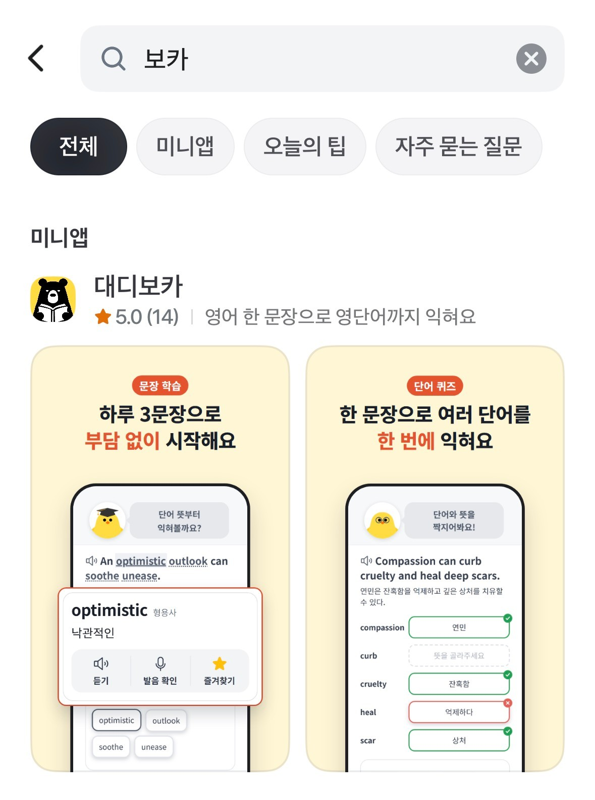{: w="420" }
_토스앱에서 대디보카를 검색해주세요_

대디보카는 토스의 미니앱으로 출시한 영어 보카 앱입니다\
토스 어플에서 검색을 하신다면 아주 쉽게 찾으실 수 있구요..\
영어 공부에 관심이 있으시다면! 한번 구경해보셔도 좋습니다

 

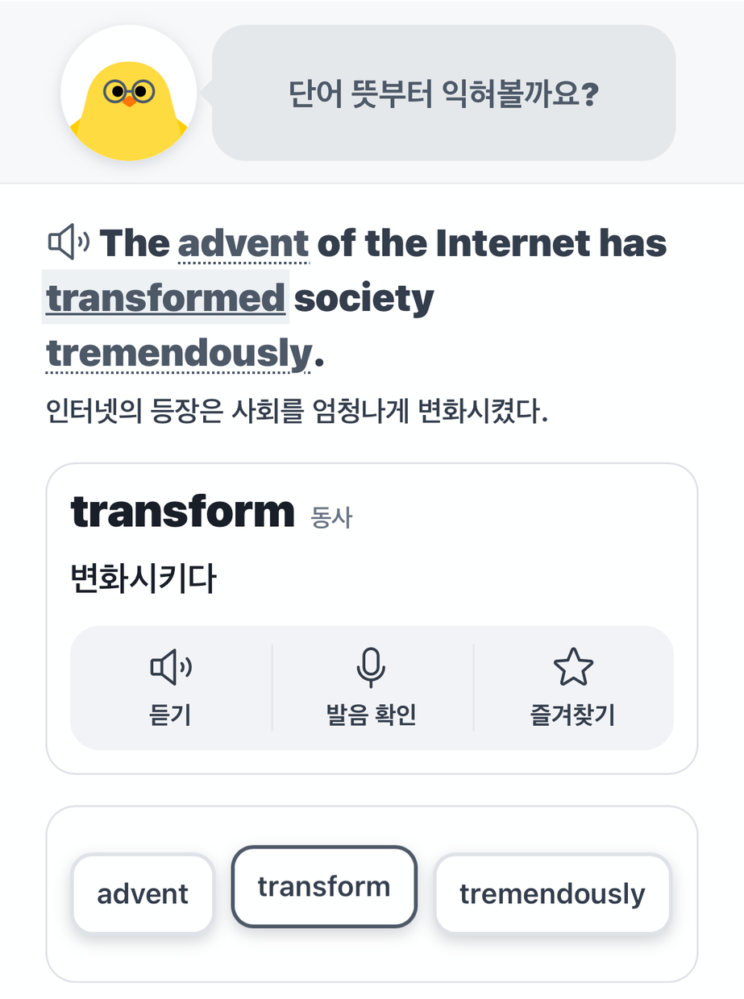{: w="420" }
_1단계: 배우기_

학습의 첫 단계로, 문장 안에서 핵심이 되는 단어들을 익힙니다!\
문장과 단어 각각을 들어볼 수 있게 했구요..\
직접 마이크를 통해 본인의 발음도 확인할 수 있게 했슴다\
헷갈리는 단어는 즐겨찾기를 해서 나중에 모아볼 수도 있겠습니다!

 

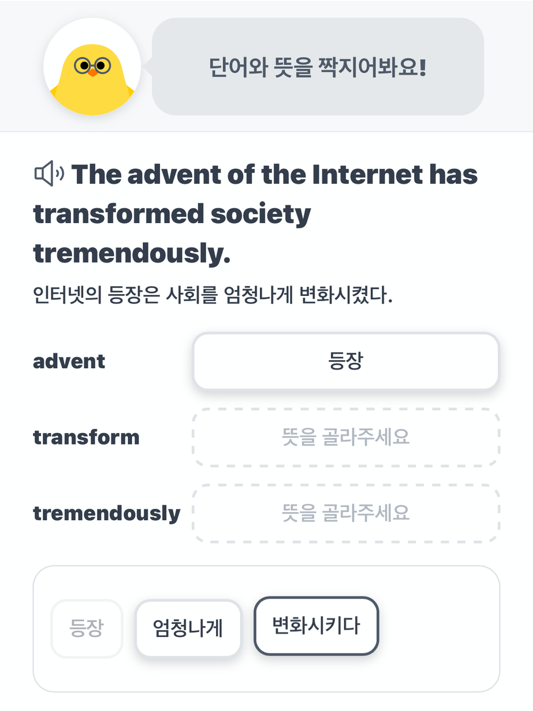{: w="420" }
_2단계: 맞추기_

두 번째 단계로, 각 단어들의 뜻을 맞춰봅니다!\
'다시 앞 단계로 넘어가서 보고 오면 되는 거 아니냐' 하실 수 있으신데요,\
맞습니다! 마음껏 보고 오셔도 좋구요.\
여기서는 뇌의 단기기억으로 잠깐 남기는 것이 목표니 괜찮습니다

 

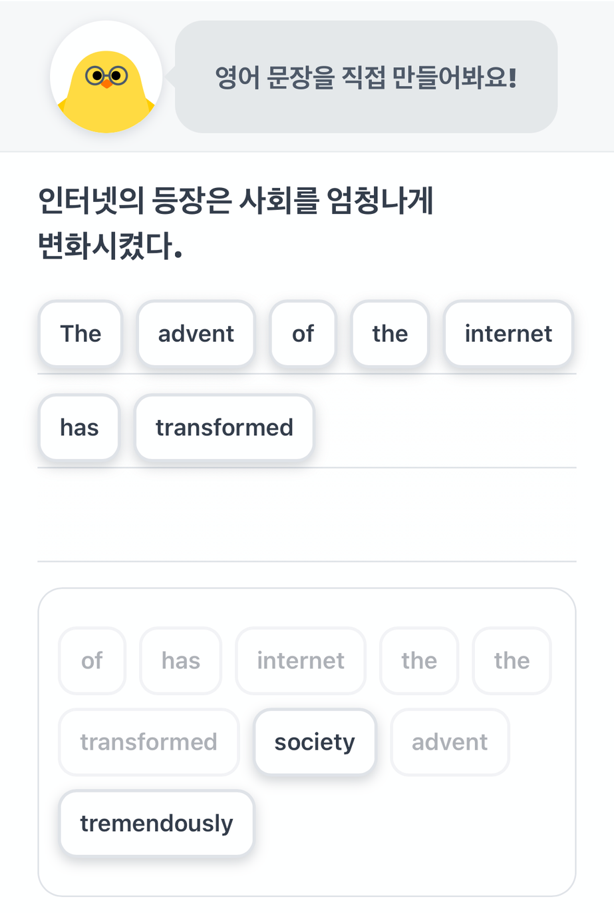{: w="420" }
_3단계: 쓰기_

마지막으로 영작의 시간이구요.\
앞에서 배운 문장을 다시 만들면 됩니다!\
이런 식의 영어 공부는 손으로 직접 써보는 게 가장 효과적이라고 생각하는데요,\
모바일 환경에서는 현실적으로 쉽지 않으니.. 이렇게 타협해봤습니다.

이 부분의 채점 로직과 힌트 버튼의 동작 방식에 공을 꽤나 들였는데요..\
자세한 내용은 회고에서 대충 얘기해보겠습니다

 

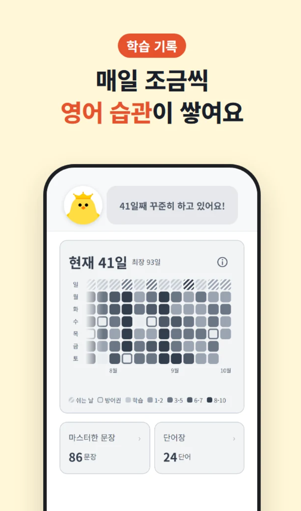{: w="340" }
_잔디_

이렇게 매일 약 5분 정도씩.. (더 길어질 수도 있는데 10분 정도까지는 봐주시길)\
꾸준히 학습을 하다 보면!! 아주 좋은 영어 습관이 생겨 있는 자신을 보실 수 있으실 거예요.

참고로 위의 이미지는.. 저의 실제 연속 학습일이 길지 않은 관계로(?\
어플 상세 페이지용 연출 이미지로 대체하겠습니다..

연속 학습 기능을 꼭 넣고 싶었는데!! 넣다 보니 그냥 끊겨버리는 게 마음이 아파서\
방어권도 넣고.. 쉬는 날도 넣고.. 하다 보니 좀 다채로운(?) 히트맵을 연출할 수 있습니다!\
더 많은 일이 있었던 것 같고 쉽지 않았던 학습 기록처럼 보일 수 있다랄까..

 

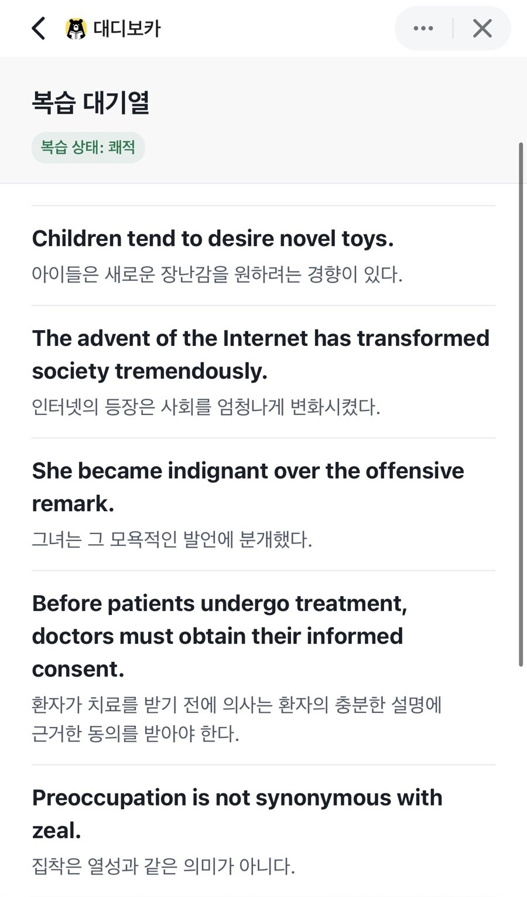{: w="380" }
_복습 대기열_

(복습 대기열이 잘 활성화되어 있는 아무개의 이미지를 첨부합니다)\
대디보카의 핵심이라 하면 바로 이 복습 대기열인데요!\
정확히 맞은 문장은 나\~\~중에 한 번 다시 물어보고..\
완벽하지 않은.. 학습이 약간 아쉬웠던 문장은 빠르게 다시 물어보며..

정말 꼭 외워야만 해!!!!\
난 이 학습에 모든 집중을 다해야 하고, 이건 아주 부담스러운 일이야\
하실 것 없이..\
당신이 정말 완벽히 외운 문장만 졸업시켜 주고,\
다시 보고 싶은 문장은 또 복습 대기열에서 만날 수 있는 아주 좋은 경험을 하실 수 있을 겁니다

 

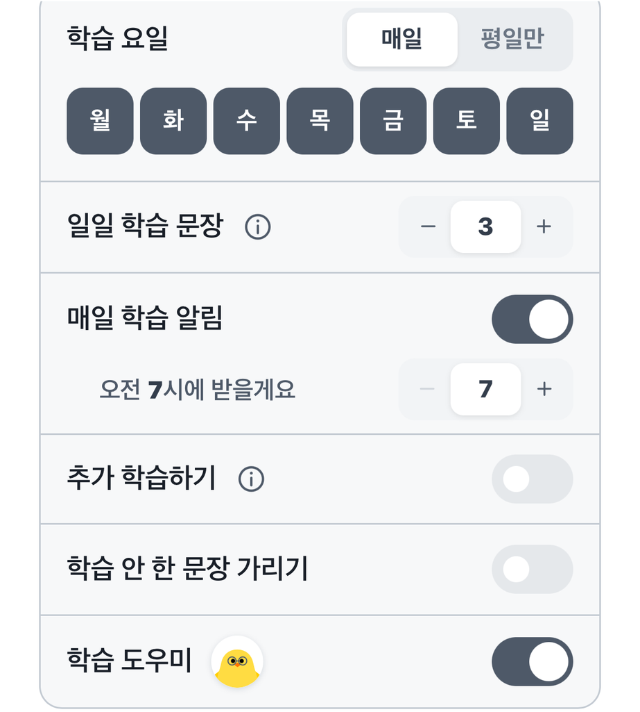{: w="420" }
_설정 화면_

이런 식으로 수많은.. 편의성 기능들을 넣어봤구요.\
하루 학습량을 조절할 수도 있고!! 쉬는 날을 설정할 수도 있고..\
많은 편의성 기능을 넣어봤습니다!!!

이외에도 메인에 있는 캐릭터도 동생을 시켜서 개선하고 싶고..\
캐릭터를 터치했을 때의 피드백도 줄 계획이고!! 연속 학습이 올라갔을 때의 연출도 곧 추가할 겁니다!!!

필요한 기능과 개선 사항이 있다면 누구라도 저에게 말해주셨으면 좋겠구요..\
따끔한 피드백.. 없겠지만.. 있다면 꼭 말해주세요 쭈굴

 

## 2. 회고

아버지께서는 제가 아주 어렸을 때부터 영어를 굉장히 잘하셨습니다\
솔직히 잘 기억은 안 나지만..\
영어 회사(?)도 다니셨고.. 영어 문제 출제(?)도 하셨구요! (정확히 뭐였는지는 모르겠습니다)\
영어 책도 여럿 출판하셨었습니다.

몇 살인지도 모를 때 영어 어쩌구 자격시험(?)을 보러 갔었는데\
거기서 아버지의 문법 책으로 공부를 하고 있는 가족을 마주쳤었고!\
어머니께서는 가서 인사를 해보라고 하시고\
아버지는 극구 사양하셨던 기억이 있네요

또 영어 관련.. 무슨 녹음도 하셨었는데.. (언제인지도 모르겠습니다)\
어릴 적 생일에 아버지가 집전화로 아구몬에게 전화가 왔다며(?)\
아구몬 성우분께서 생일을 축하해주셨던 기억도 있네요

{: w="500" }
_아구몬_

암튼.. 결론은! 아버지께서 굉장히 예전부터 생각하시던 영어 학습 방법론(?)이 있었는데,\
영어 문장 하나를 익히면서 자연스럽게 단어까지 익히는..\
그런 방식이었슴다\
최근 문득 아버지께 이런 어플이 있으면 좋겠다는 얘기를 듣고..

딱히 오래 걸릴 것 같지도 않다\
\+ 딱히 요즘 하는 일도 없다\
\+ 딱히 평소에 효도도 안 하고 있다\
의 이유로 한번 어플을 만들어보자! 는 생각으로 어플을 만들어봤슴다.

 

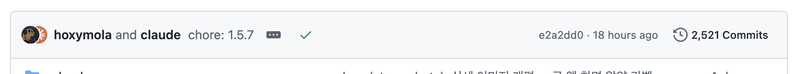{: w="700" }
_커밋이 2521개!_

클로드코드의 PRO 플랜을 2개월간 구독하여 작업했구요.\
부끄럽지만 한 줄의 코드도 작성하지 않고 작업했습니다 크하하\
커밋도 무슨 2500번이나 했네요

 

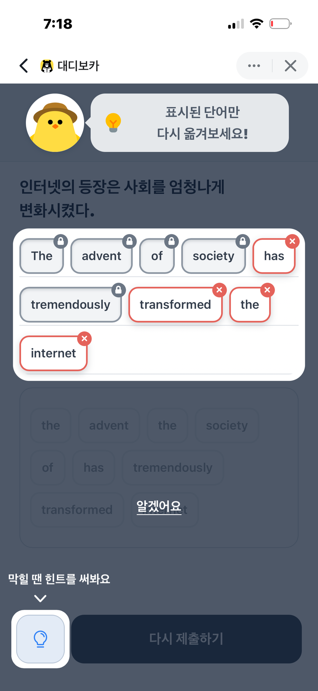{: w="420" }
_채점 화면_

이 부분의 채점 로직과 힌트 버튼의 동작 방식에 꽤나 공이 들어갔는데요..\
결국 제가 느낀 것은..\
이런 식으로 순서를 배열하는 문제에서\
맞는 위치와 틀린 위치를 결정하는 모두에게 납득되는 방식을 떠올리는 것은 어렵다! 였습니다\
(이런 식으로 서비스하는 경우가 있는지도 잘 모르겠구요)

1) 정확히 맞는 위치만 '정답'으로 체크하자니..\
ABCDE가 정답인 문장에서,\
'E' ABCD라고 입력하면 모든 위치가 오답으로 표시되는 게 납득하기 힘들 것 같았구요

2) 정답 배열의 앞에서부터 가장 길게 일치하는 배열을 고르는 방식으로 하자니\
위와 비슷하게.. 아무리 전체적인 문장 배열이 괜찮은(?) 경우에도\
배열의 앞부분에서 틀려버리면 대부분의 타일이 오답으로 처리되는 이슈가 있었습니다

그래서 결국..\
어차피 사용자의 입장에서\
'이 단어는 맞았다고 표시가 되었으니 맞는 배치구나!\
이 단어는 틀렸다고 표시가 되어 있으니 맞지 않은 배치고.. 어쩌구 저쩌구'\
하지는 않을 것이다 판단하여..

정답 단어 자체는 LIS 방식으로 가장 긴 증가하는 부분수열 알고리즘을 사용해서 채점했구요.

즉 현재 제출 배열에서 가장 최소한으로 이동했을 때 어떻게 하면 정답 배열이 될 수 있을지!\
그때의 이동해야 하는 단어를 오답 / 이동하지 않아도 되는 단어를 정답으로 체크했고..

힌트는.. 오답으로 표시된 단어를 정답 위치로 이동하게 되며..\
따라서 정확히 오답으로 체크된 최소 횟수의 힌트 클릭을 통해 정답 배치를 만들 수 있게 했습니다..\
(아무도 안 궁금하셨겠지만..)

 

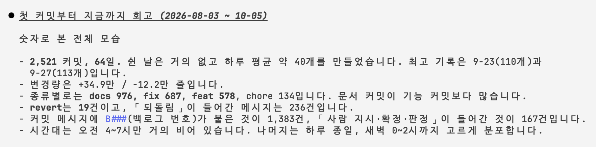{: w="700" }
_클로드가 정리해 준 회고_

클로드가 뽑아준 회고.. 2개월 동안은 게임도 안 하면서 한 것 같아요\
물론 최초 기획을 제외한 대부분의 UI/UX 및 구현을 클로드에게 맡겼지만..\
기존의 다른 AI가 뽑아낸 듯한 서비스들과는 다르게 보이고 싶었고!!\
빨리 유기농 사용자들이 들어와서 많은 피드백을 받았으면 좋겠다!!!

 

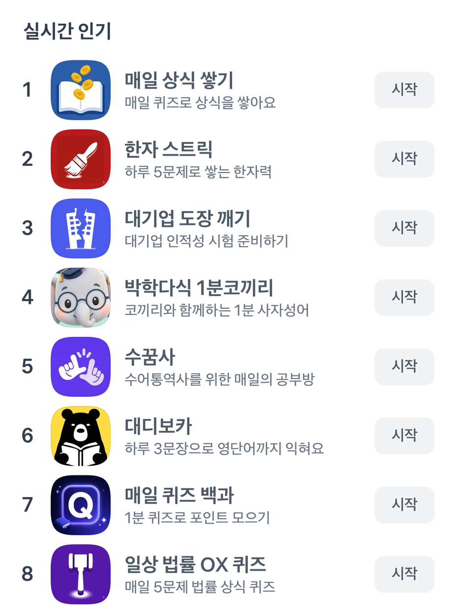{: w="420" }
_오픈빨로 교육카테고리 6위가 된 대디보카_

다시 읽어보니 생각한 것보다 글이 더 안 읽혀서 너무 당황스럽지만..\
매달 발전하는 감자요리를 기대해주세요\
하나 둘 셋 대디보카 화이팅!
